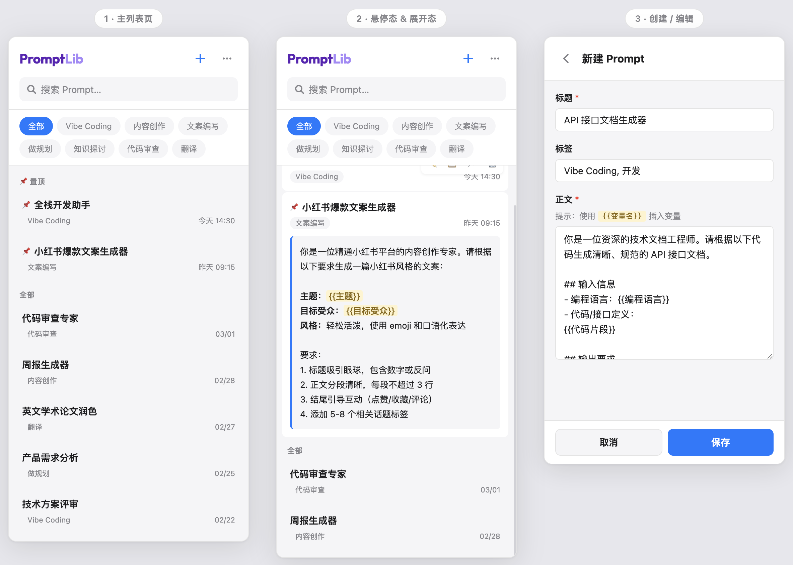

# PromptLib

> 帮助 AI 大模型使用者在浏览器内实时管理和调用提示词模板的 Chrome 侧边栏插件。
>
> A Chrome Side Panel extension for managing and using prompt templates with AI chatbots.



---

## 功能特性 / Features

**中文**

- 创建、编辑、删除 Prompt 模板
- 支持 Markdown 格式正文，点击即可展开预览
- 一键复制到剪贴板，支持 `{{变量名}}` 变量替换
- 置顶常用 Prompt，快速访问
- 标签分类 + 关键词实时搜索
- 导入/导出 JSON 数据备份
- 所有数据存储在本地，不上传任何服务器

**English**

- Create, edit, and delete prompt templates
- Markdown content with inline expand preview
- One-click copy with `{{variable}}` replacement support
- Pin frequently used prompts to the top
- Tag filtering + real-time keyword search
- Import/Export JSON backup
- All data stored locally, no server communication

---

## 安装 / Installation

### 从 Chrome Web Store 安装（推荐）

> 尚未发布，敬请期待。

### 本地开发安装

**中文**

1. 克隆仓库并安装依赖：

```bash
git clone https://github.com/lotusnring/promptlib.git
cd promptlib
npm install
```

2. 构建项目：

```bash
npm run build
```

3. 打开 Chrome 浏览器，访问 `chrome://extensions/`
4. 开启右上角「开发者模式」
5. 点击「加载已解压的扩展程序」，选择项目中的 `dist/` 目录
6. 点击工具栏的 PromptLib 图标，侧边栏即可打开

**English**

1. Clone the repository and install dependencies:

```bash
git clone https://github.com/lotusnring/promptlib.git
cd promptlib
npm install
```

2. Build the project:

```bash
npm run build
```

3. Open Chrome and navigate to `chrome://extensions/`
4. Enable "Developer mode" in the top right corner
5. Click "Load unpacked" and select the `dist/` directory
6. Click the PromptLib icon in the toolbar to open the side panel

---

## 使用说明 / Usage

| 操作 / Action | 说明 / Description |
| :--- | :--- |
| 新建 Prompt | 点击顶部 **+** 按钮，填写标题、标签、正文后保存 |
| 编辑 | 悬停到 Prompt 上，点击 ✏️ 按钮 |
| 复制 | 点击 📋 按钮，含变量时会弹出填写表单 |
| 置顶 | 点击 📌 按钮，常用 Prompt 固定在顶部 |
| 删除 | 点击 🗑️ 按钮，需二次确认 |
| 标签筛选 | 点击顶部标签 pill 快速过滤 |
| 搜索 | 在搜索框输入关键词，实时筛选标题和正文 |
| 导入/导出 | 点击右上角 **⋯** 菜单 |

---

## 技术栈 / Tech Stack

| 技术 / Technology | 用途 / Purpose |
| :--- | :--- |
| React 18 | 前端框架 / UI Framework |
| TypeScript | 类型安全 / Type Safety |
| Vite + @crxjs/vite-plugin | 构建工具 / Build Tool |
| CSS Modules | 样式隔离 / Scoped Styles |
| marked | Markdown 渲染 / Markdown Rendering |
| Chrome Extension Manifest V3 | 插件规范 / Extension Standard |
| Chrome Side Panel API | 侧边栏展示 / Side Panel Display |
| chrome.storage.local | 本地数据存储 / Local Data Storage |

---

## 项目结构 / Project Structure

```
promptlib/
├── public/
│   ├── manifest.json          # Chrome MV3 配置
│   └── icons/                 # 插件图标
├── src/
│   ├── background.ts          # Service Worker
│   ├── sidepanel.html         # 入口 HTML
│   ├── main.tsx               # React 入口
│   ├── App.tsx                # 主应用
│   ├── styles/variables.css   # 设计 token
│   ├── types/                 # TypeScript 类型
│   ├── services/              # 数据存储服务
│   ├── hooks/                 # React Hooks
│   ├── utils/                 # 工具函数
│   └── components/            # UI 组件
│       ├── Header/            # 顶部栏
│       ├── TagBar/            # 标签筛选
│       ├── PromptCard/        # 列表项
│       ├── PromptList/        # 主列表
│       ├── PromptForm/        # 创建/编辑表单
│       ├── Modal/             # 模态弹窗
│       ├── VariableModal/     # 变量填写
│       ├── DeleteConfirm/     # 删除确认
│       ├── Toast/             # 提示通知
│       └── ImportResult/      # 导入结果
├── vite.config.ts
├── tsconfig.json
└── package.json
```

---

## 本地开发 / Development

```bash
# 安装依赖 / Install dependencies
npm install

# 开发模式 / Development mode
npm run dev

# 生产构建 / Production build
npm run build
```

---

## 隐私说明 / Privacy

**中文：** PromptLib 的所有数据均存储在用户本地浏览器中（chrome.storage.local），不会向任何外部服务器传输数据。

**English:** All data in PromptLib is stored locally in the user's browser (chrome.storage.local). No data is transmitted to any external server.

---

## 许可证 / License

MIT
